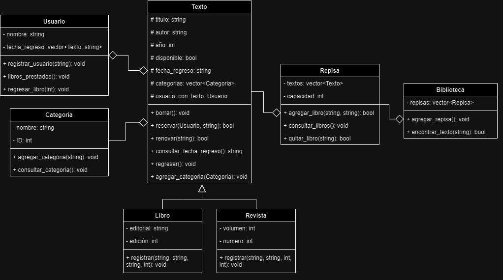

# Inventario Biblioteca
## Contexto
Las bibliotecas son lugares en donde se recopila una cantidad enorme de libros, revistas, publicaciones, entre otros textos. Generalmente, estos recursos son categorizados para así elegir una ubicación estratégica en la biblioteca. Asimismo, suele ser importante llevar un registro de cada uno de los textos disponibles y su historial de préstamos. 
Sin embargo, el llevar un registro a papel de todo esto, puede llegar a ser algo poco eficiente, ya que el actualizarlo requiere de mucho esfuerzo, y el encontrar un texto en específico podría llevar mucho tiempo.

## Interés
Las bibliotecas tienen una cantidad inmensa de recursos, y me parece interesante el cómo se suelen clasificar estos para lograr identificar la ubicación y los detalles de cada uno de ellos. Me gustaría poder implementar algo que facilite este registro, así como la búsqueda de los recursos disponibles.

## Propuesta
Para evitar hacer todo a papel, considero que es importante tomar en cuenta la tecnología que tenemos disponible, realizando un inventario digital, para así simplificar el proceso de actualización de cada recurso, y tener una herramienta de búsqueda que encuentre los textos de una manera sencilla y rápida.

## Diagrama UML
  
La función de cada clase es la siguiente:
* **Repisa:** Contendrá todos los textos disponibles en la biblioteca.
* **Texto:** Será la clase base para cualquier tipo de recurso que la repisa guarde (como libros y revistas).
* **Libro:** Un Texto de tipo libro, que además de los atributos de Texto, tendrá editorial y edición.
* **Revista:** Un Texto de tipo revista, que además de los atributos de Texto, tendrá un volumen y número de publicación.
* **Usuario:** Una clase que contendrá la información de las personas que pidan algún texto, como sus nombres, y los libros que han pedido, así como la fecha en que los regresarán.
* **Categoria:** Esta clase permitirá que los libros sean categorizados (ejemplos: Matemáticas, Ciencias, Filosofía, Economía, Ciencia Ficción, etc.), para así facilitar la identificación de los textos dentro de cierta área.

## Cómo utilizar el programa
Este inventario tiene 6 funcionalidades principales:
* Registrar un usuario
* Registrar un texto
* Reservar un texto
* Renovar un texto
* Regresar un texto
* Ver textos en la biblioteca

Este inventario puede registrar dos tipos de textos: libros o revistas. La interacción con el programa es intuitiva, ya que esta irá indicando lo que se necesita ingresar, dependiendo de la acción que se quiera realizar. Sin embargo, aquí hay una pequeña descripción de cada una de las acciones:
  
**Registro de usuario** 
Cuando se desea registrar a un usuario, se le solicitará el nombre de este, y un teléfono. Dos usuarios no podrán tener el mismo nombre.
  
**Registro de texto** 
Cuando se desea registrar un texto, se solicitarán los datos del texto a registrar.
  
**Reserva de texto** 
Para la reservación de un texto, se solicitará el título del texto y el nombre del usuario que está reservando el texto. Si el texto no existe, se indicará esto, y si el usuario no existe, se creará un nuevo usuario en el momento. Si la reserva es exitosa, se muestra la fecha en la que se espera que el libro sea devuelto.
  
**Renovación de texto** 
Para renovar un texto, simplemente se necesita el título de este, y si efectivamente alguien tiene el texto, se indicará la nueva fecha en la que se espera que el libro sea devuelto.
  
**Regreso de texto** 
Al regresar un texto, simplemente es necesario indicar el título de este.
  
**Ver textos en la biblioteca** 
Esta opción permitirá ver todos los textos que han sido registrados en la revista, siendo ordenados por repisa y por orden de registro.
  

## Cómo correr este programa
Para correr este programa, siga las siguientes instrucciones:
1. Descargue el ZIP, y extráigalo.
2. Abra una terminal en la carpeta "InventarioBiblioteca"
3. Compile el código con la línea "g++ Biblioteca.cpp -o Biblioteca.exe"
4. Ejecute el código con la línea "Biblioteca.exe"